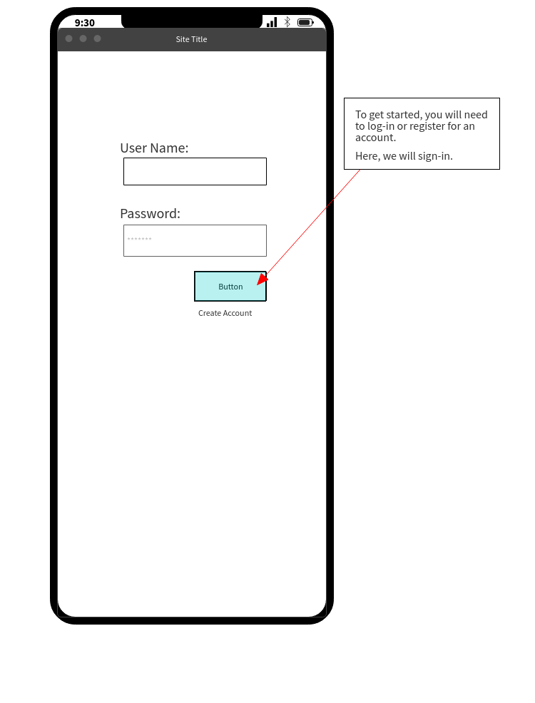
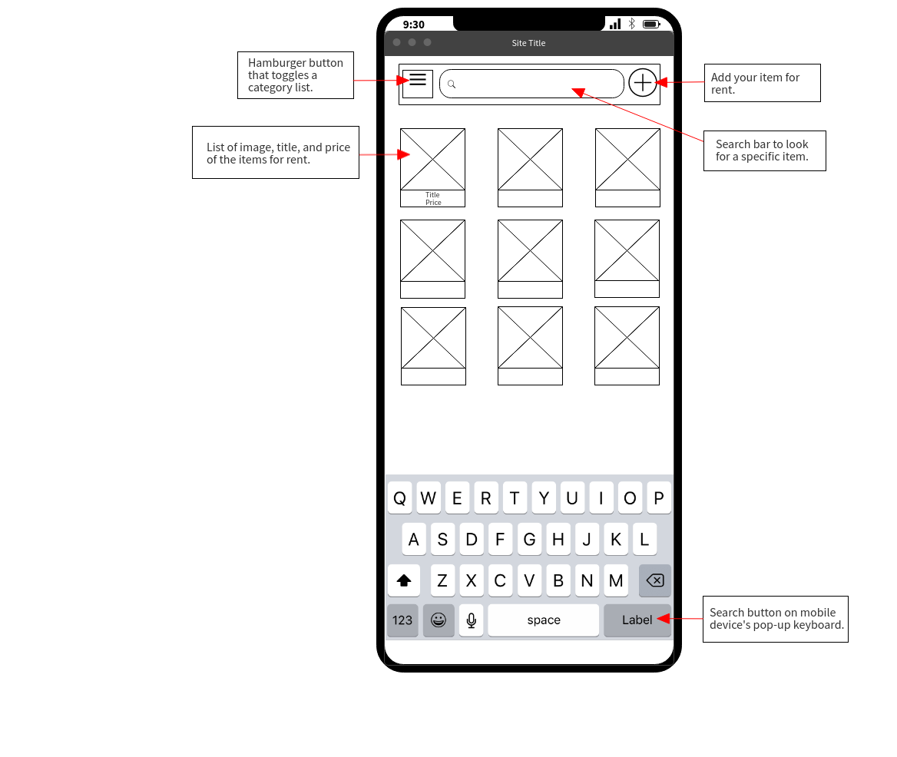
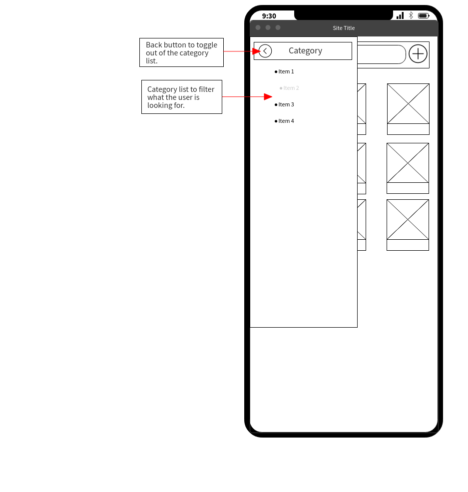
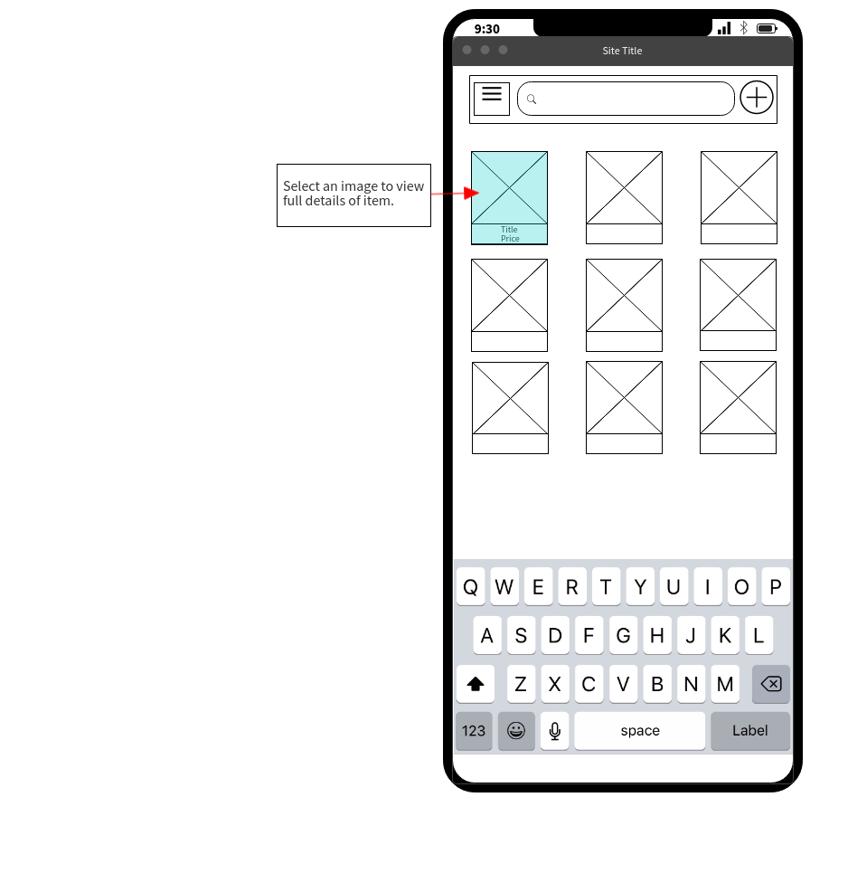
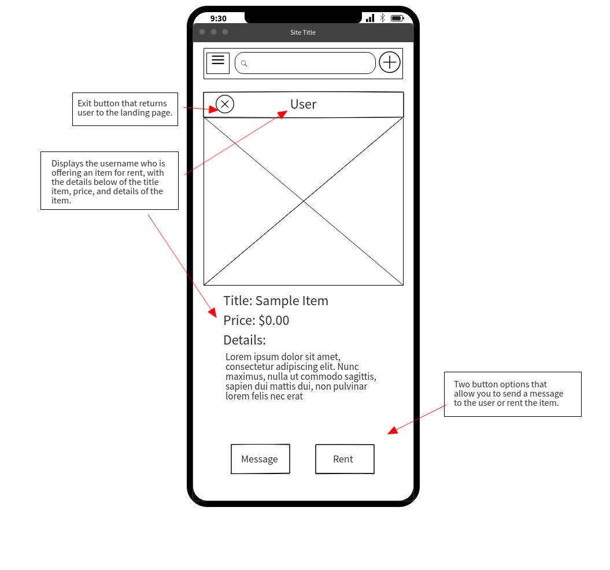
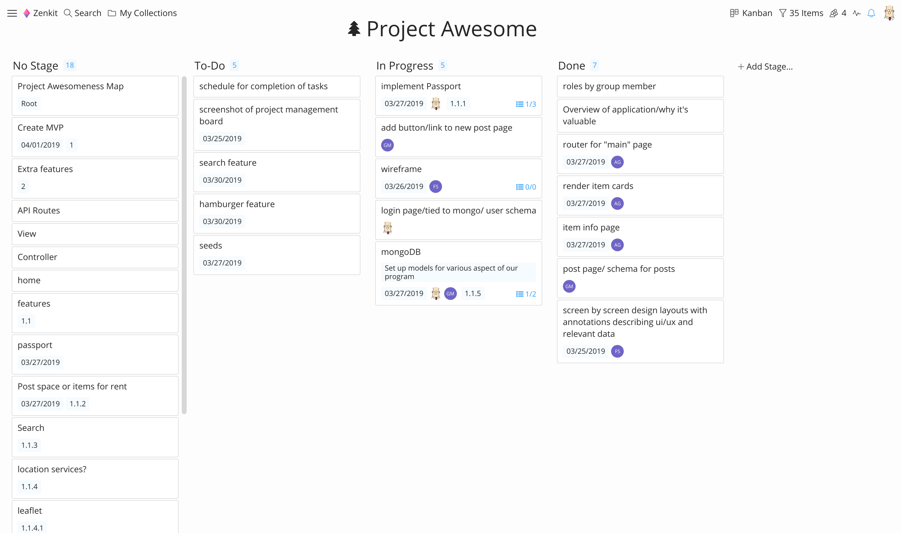
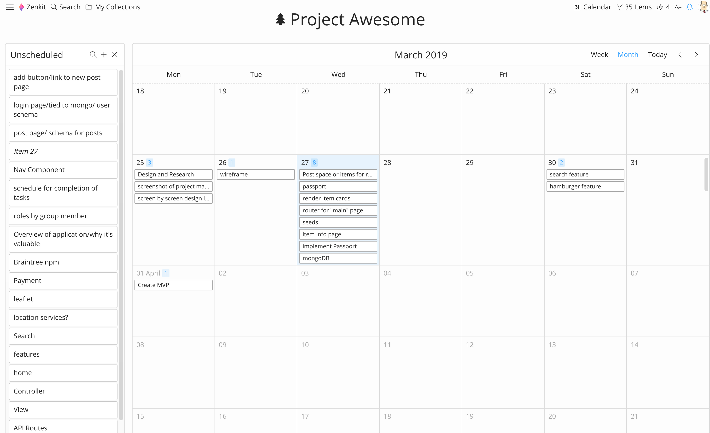

# TheMinimalist
Have you ever wanted to reduce clutter and get rid of stuff but thought to yourself, "But what if I need this later?" or "I only use this once a year and it takes up so much space!" The answer to this dilema is: *TheMinimalist*.

*TheMinimalist* is a peer-to-peer rental service for any and all of those things that you might need just once a year. If you have an item that you want to rent, or that you want to rent out to others for extra money, look no further! You journey to a clutter-free life starts now :)

# App Introduction
We strive to make the experience of the app match our minimalist philosophy: simple, high quality, and enjoyable. All of our pages emulate this philosophy, so relax and enjoy!

## Login
You probably want less, but no one wants stuff stolen, so we take your security seriously. Every use needs to login. Eventually we will enable login through Facebook, Google, GitHub, and others, as well as two factor authentication. This is at the top of our priority list.

## Main Layout
Logging in will drop you on the main page, with recently added items loaded by default.

## Filter Content
If you don't to search for something specific, you can filter based on categories by accessing the sidebar.

## Item Description
Once you find an item you'd like to know more about or rent, just click it.

## The App Layout
In case you want to see where all the screens are and how they fit together, we got you covered :)

# Task List and Schedule

# The Team
## Anetta Goldsher
The team leader, AKA professional nag. She kept us on schedule and worked on the main interface components.
## Felicia
Our UX guru. She did our wireframing and design, and then hoped on other parts as necessary
## Gregory Mash
King-of-all-trades, also known as the "Mash-ter", Gred worked on the databases, server, and React frontend.
## John
If you liked this guide, then John is the man to thank, and if you didn't like it then just say "%#&*@#!" in his general direction. Also, submit a bug request so that John can help reduce the cursing and increase your happiness. John is also responsible for app security and created Login Page and the authentication protocols on the server.